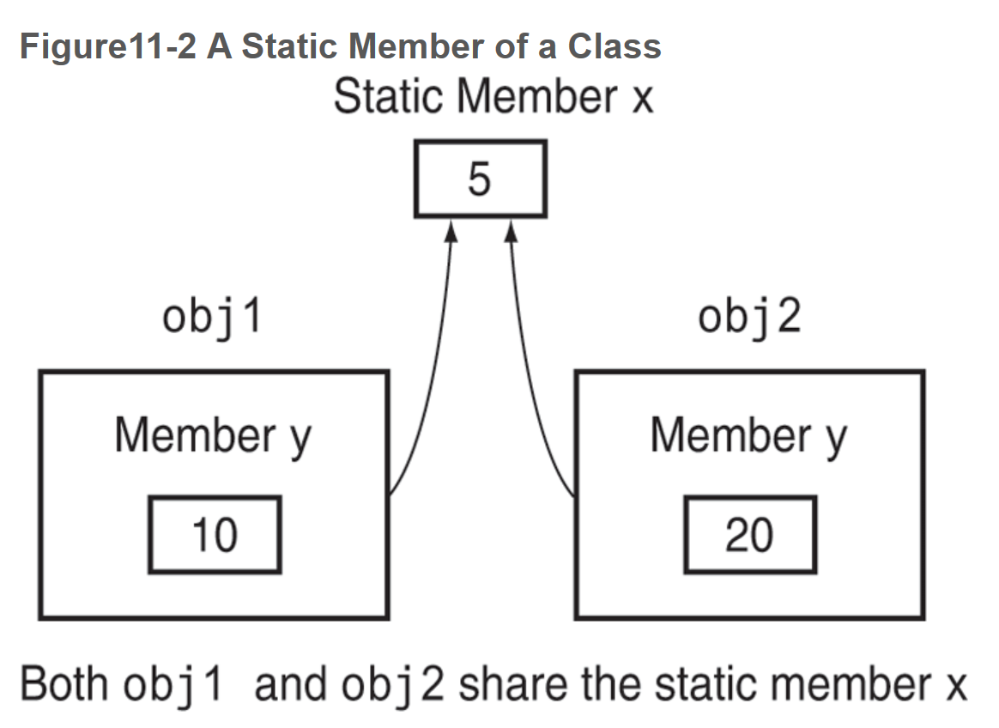
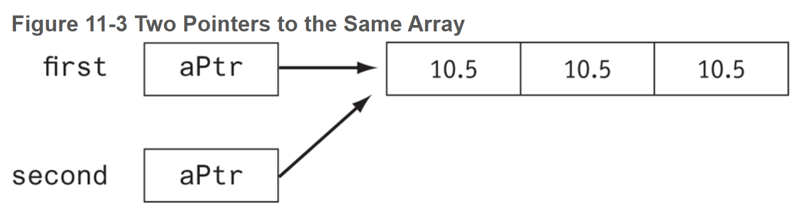
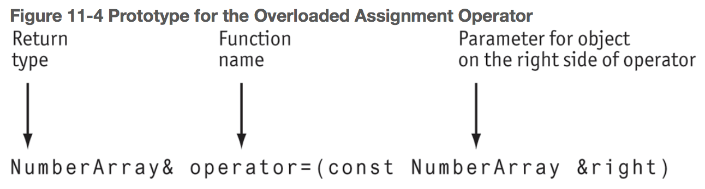

# Chapter 11: More about Classes and Object-Oriented Programming


### 11.1 The `this` Pointer and Constant Member Functions

By default, the compiler provides each member function of a class with an implicit parameter that points to the object through which the member function is called. The implicit parameter is called `this`. A constant member function is one that does not modify the object through which it is called.

**The `this` Pointer**

```c++
void Example(int x)
{
	this->x = x;	// class memeber variable x = parameter x
}					// equivalent to (*this).x
```

**Constant Member Functions**: a function that cannot modify its object. Add the `const` keyword after the function’s parameter list to tell the compiler that the member function should not be allowed to modify its object.

```c++
int ConstExample::getValue() const	// must be in the declaration & definition
{
	return x;
}
```

- A function with a constant parameter  cannot turn around and pass it as a non-constant parameter to another function. The other function must also promise not to modify the parameter.


### 11.2 Static Members

If a member variable is declared `static`, all objects of that class have access to that variable. If a member function is declared `static`, it may be called before any instances of the class are defined.

##### Static Member Variables

To create a static member variable, place the keyword `static` in front of the variable declaration. Then, place a separate definition of the variable outside the class.

```c++
class StatDemo
{
    private:
    	static int x;
}

int StatDemo::x;
```

When one class object changes this static variable, it changes the value for all objects of this class.



**declaration**: provides information about the existence and type of a variable or function.

**definition**: provides all the information contained in a declaration and, in addition, causes memory to be allocated for the variable or function being defined.

Static member variables must be **declared** inside the class and **defined** outside of it.

**instance members**: a member whose use must be associated with a particular instance of a class.

**static member**: a member that does not need to be associated with any instance. Only the class of the static member needs to be specified.  

- Member functions that do not access any non-static members of their class should be made static.

- The `this` pointer cannot be used in a static member function because static member functions are not called through any instance of their class.

```c++
class StatAccess
{
   private:
      int x; 
   public:
      static void print(StatAccess a)
      {
         cout << a.x;
      }
   StatAccess(int x) { this−>x = x; }
};
```


### 11.3 Friends of Classes

A `friend` is a function that is not a member of a class but has access to the private members of the class.

The class must grant access to the friend function.

```c++
class Aux
{
private:
   double auxBudget;
public:
   Aux() { auxBudget = 0; }
   void addBudget(double);
   double getDivBudget() { return auxBudget; }
};

void Aux::addBudget(double b)
{
   auxBudget += b;
   Budget::corpBudget += auxBudget;
}
```


### 11.4 Memberwise Assignment

The `=` operator may be used to assign one object to another, or to initialize one object with another object’s data. By default, each member of one object is copied to its counterpart in the other object.


### 11.5 Copy Constructors

A copy constructor is a special constructor that is called whenever a new object is created and initialized with the data of another object of the same class.

If the programmer does not specify a copy constructor for the class, then the compiler automatically calls the *default copy constructor*. This default copy constructor simply copies the data of the existing object to the new object using memberwise assignment.

Problems may occur when copying objects with pointers, as the value of the pointer in the first object is copied to the second object, leaving both pointers pointing to the same data.



A programmer-defined copy constructor must have a single parameter that is a reference to the *same* class. This avoids the problems of the default copy constructor by allocating separate memory for the pointer of the new object before doing the copy. The parameter should be a `const` reference because the copy constructor should not modify the object being copied.

```c++
NumberArray::NumberArray(const NumberArray &obj)
```

The copy constructor is also automatically called by the compiler to create a copy of an object whenever an object is being passed by *value* in a function call. 

Class copy constructors are called when:

- A variable is being initialized from an object of the same class
- A function is called with a value parameter of the class
- A function is returning a value that is an object of the class


### 11.6 Operator Overloading

C++ allows you to redefine how standard operators work when used with class objects.

To address the problems that result from memberwise assignment of objects, we need to modify the behavior of the assignment operator so that it does something other than memberwise assignment when it is applied to objects of classes that have pointer members. In effect, we are supplying a different version of the assignment operator to be used for objects of that class. In so doing, we say that we are *overloating* the assignment operator.



- Classes that allocate dynamic memory or any kind of resource in a constructor should always define a destructor, a copy constructor, a move constructor, a copy assignment operator, and a move assignment operator.

#### Operators That Can Be Overloaded

| `+`   | `-`  | `*`   | `/`      | `%`  | `^`  | `&`  | `|`  | `~`  | `!`   | `=`  | `<`   |
| ----- | ---- | ----- | -------- | ---- | ---- | ---- | ---- | ---- | ----- | ---- | ----- |
| `>`   | `+=` | `-=`  | `*=`     | `/=` | `%=` | `^=` | `&=` | `|=` | `<<`  | `>>` | `>>=` |
| `<<=` | `==` | `!=`  | `<=`     | `>=` | `&&` | `||` | `++` | `–`  | `->*` | `,`  | `->`  |
| `[]`  | `{}` | `new` | `delete` |      |      |      |      |      |       |      |       |

There are two approaches you can take to overload an operator:

1. **Make the overloaded operator a member function of the class**. This allows the operator function access to private members of the class. It also allows the function to use the implicit `this` pointer parameter to access the calling object.
2. **Make the overloaded member function a separate, stand-alone function**. When overloaded in this manner, the operator function must be declared a friend of the class to have access to the private members of the class.

```c++
Length a(4, 2), b(1,8), c(0);
c = a + b;

// the compiler sees this as
c = a.operator+(b);

c = a + 2;
c = 2 + a; // does not compile if overloaded operator function is a member. must make it standalone.
```

When overloading stream insertion operators, the first argument should be the `ostream` or `istream` object which is passed by reference `&` and the second parameter should be passed by value. The stream insertion operator should returns its stream parameter so that several output expressions can be chained together.

```c++
ostream &operator<<(ostream& out, Length a)
{
   out << a.getFeet() << " feet, " << a.getInches() << " inches";
   return out;
}
```

This is useful because it allows fields of a complex class to be labeled during output.

Overloading the stream input operator is similar, except that the class parameter signifying the object to be read into must be passed by reference. Thus, the header for the stream input operator looks like this:

```c++
istream &operator>>(istream &in, Length &a);
```


### 11.7 Rvalue References and Move Operations

An Rvalue reference denotes a temporary object that would otherwise have no name. A move operation transfers resources from a source object to a target object. A move operation is appropriate when the source object is temporary and is about to be destroyed.

**lvalue reference** - a memory location associated with a name that can be used to access it from other parts of the program.

**rvalue** - a temporary value that cannot be accessed from other parts of the program.

**rvalue reference**(`&&`) - a reference to a temporary object that would otherwise have no name. It assigns a name to a temporary memory location, making it possible to access the location from other parts of the program and transforming the temporary location into an lvalue.

**move assignment operator** - when a copy assignment happens, a temporary object is created before the values are copied. Then, the temporary object is destroyed. A move assignment operator avoids this work by having the object being assigned to swap resources with the temporary object.

```c++
NumberArray& NumberArray::operator=(NumberArray&& right) // must be an rvalue, cannot be const
{
    if (this != &right)
    {
       swap(arraySize, right.arraySize);
       swap(aPtr, right.aPtr);
    }
    return *this;
}
// Move constructor
NumberArray::NumberArray(NumberArray && temp)	// must be an rvalue, cannot be const
{
    // "Steal" the resource from the temp object
    this−>arraySize = temp.arraySize;
    this−>aPtr = temp.aPtr;
    // Put the temp object in a safe state
    // for its destructor to run
    temp.arraySize = 0;
    temp.aPtr = nullptr;
}
```

Like the copy constructor and assignment operator, move operations are called by the compiler when appropriate. Specifically, the compiler uses a move operation when

1. a function returns a result by value, or
2. an object is being assigned to and the right-hand side is a temporary object, or
3. an object is being initialized from a temporary object.


#### Default Operations

For a class `MyClass`, the compiler can generate

- a default constructor `MyClass()`
- a copy constructor `MyClass(const MyClass &)`
- a copy assignment operator `MyClass & operator=(const Myclass &)`
- a move constructor `MyClass(MyClass &&)`
- a destructor `~MyClass()`


Two rules govern the default generation of these operations:

1. If you declare *any* constructor, the compiler will assume that objects of your class require special initialization and will not provide a default constructor.
2. If you provide a nondefault implementation of any of these operations, the compiler will not generate implementations for any of them. This means, for example, that if you define a copy constructor for your class, then you should also define copy assignment, both move operations, and a destructor. Similarly, if you define a destructor for your class, then you should also define all copy and move operations.


### 11.8 Type Conversion Operators

Special operator functions may be written to convert a class object to any other type.

```C++
double d;
Length distance;
// no return type; it is inferred from the name of the operator function
Length::operator double() const
{
	return len_inches /12 + (len_inches %12) / 12.0;
}

d = distance;
```


### 11.9 Convert Constructors

A constructor that takes a single parameter of a type other than its class type can be regarded as converting its parameter into an object of its class. Such a constructor is called a **convert constructor**.

Convert constructors are automatically invoked by the compiler when:

1. An object of the class is initialized with a value of the convert constructor’s parameter type: for example

   ```c++
   IntClass intObject = 23;
   ```

2. An object of the class is assigned a value of the convert constructor’s parameter type: for example

   ```c++
   intObject = 24;
   ```

3. A function expecting a value parameter of the class type is instead passed a value of the constructor’s parameter type. For example, we may define a function

   ```c++
   void printValue(IntClass x)
   {
      cout << x.getValue();
   }
   ```

   and then pass it an `int` when we call it:

   ```c++
   printValue(25);
   ```

   The compiler will use the convert constructor to convert the integer `25` into an object of the `IntClass` class and will then pass the object to the function. The compiler will not invoke the convert constructor if the formal parameter is a pointer or a reference to an `IntClass` object: *Convert constructors are only invoked when the formal parameter uses pass by value*.

4. A function that declares a return value of the class type actually returns a value of the convert constructor’s parameter type. For example, the compiler will accept the following function:

   ```c++
   IntClass f(int intValue)
   {
       return intValue;
   }
   ```

   Note that the function returns a value of type integer, even though `IntClass` is declared as its return type. Again, the compiler will implicitly call the convert constructor to convert the integer `intValue` to an `IntClass` object. It is this object that is returned from the function.


### 11.10 Aggregation and Composition

Class aggregation occurs when an object of one class owns an object of another class. Class composition is a form of aggregation where the owner class controls the lifetime of objects of the owned class.

**aggregation**: a situation in which objects of one class own objects of other classes.

**has-a** relationship: when a class has a member that is an object of another class or has a pointer to an object of another class. 

Member initialization list:

```c++
class Date
{
   string month;
   int day, year;
public:
   Date(string m, int d, int y):	// colon required
      month(m), day(d), year(y)  // Initialization list
   {
   }
};
```

**composition**: special cases of aggregation in which the lifetime of the owned object coincides with the lifetime of its owner.


### 11.11 Inheritance

**is-a** relationship: when one object is a specialized version of another object.

**base class**: the general class

**derived class**: the specialized class

