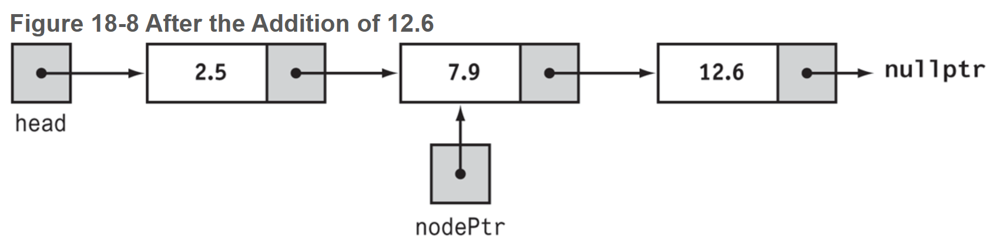
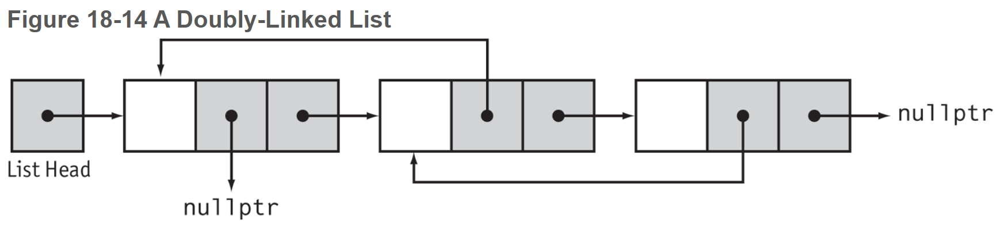
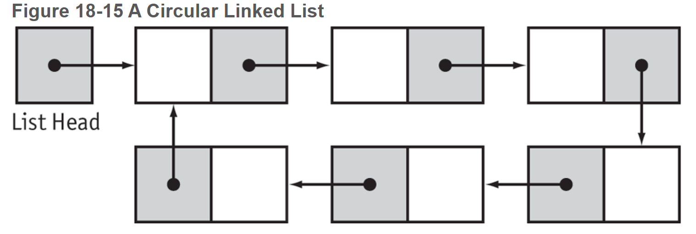

# Chapter 18: Linked Lists

### 18.1 Introduction to Linked Lists

Dynamically allocated data structures may be linked together in memory to form a chain.

**linked list** - a series of connected nodes, where each node is a data structure. The nodes of a linked list are usually dynamically allocated, used, then deleted, allowing the linked list to grow or shrink in size as the program runs.

- If new information needs to be added to a linked list, the program allocates another node and inserts it into the series.

- If a particular piece of information needs to be removed from the linked list, the program deletes the node containing that information.
- Each node in a linked list contains one or more members that hold data.
- In addition to data, each node contains a **successor pointer** that points to the next node in the list.

- The first node of a nonempty linked list is called the **head** of the list.
- To access the nodes in a linked list, you need to have a pointer to the head of the list.
- The successor pointer in the last node is set to `nullptr` to indicate the end of the list.
- 

- Nodes may be scattered around various parts of memory.

```c++
struct ListNode
{
   double value;	// data
   ListNode *next;	// successor pointer
  // (self-referential structure)
};

ListNode *head = nullptr;	// head
head = new ListNode;	// allocate new node
head->value = 12.5;		// store the value
head->next = nullptr;	// signify end of list

ListNode *secondPtr = new ListNode;
secondPtr−>value = 13.5;
secondPtr−>next = nullptr;   // second node is end of list
head−>next = secondPtr;      // first node points to second
```

- It is convenient to provide the structures that define the type for a list node with one or more constructors, to allow nodes to be initialized as soon as they are created.
- It is common to provide a default parameter of `nullptr` for the successor pointer of a node.

```c++
struct ListNode
{
   double value;
   ListNode *next;
   // Constructor
   ListNode(double value1, ListNode *next1 = nullptr)
   {
      value = value1;
      next = next1;
   }
};

ListNode *secondPtr = new ListNode(13.5);
ListNode *head = new ListNode(12.5, secondPtr);
// OR
ListNode *head = new ListNode(13.5);
head = new ListNode(12.5, head);
```

**Traversing a List**

```c++
ListNode *ptr = numberList;
while (ptr != nullptr)
{
   cout << ptr−>value << " ";   // Process node
   ptr = ptr−>next;             // Move to next node
}
```

### 18.2 Linked List Operations

The basic linked list operations are adding an element to a list, removing an element from the list, traversing the list, and destroying the list.

When a class contains pointers to dynamically allocated memory, it needs to be equipped with both a copy constructor and an overloaded assignment operator before it can safely be used in situations that require copies of lists to be made.

#### Adding an Element to the List

```c++
void NumberList::add(double number)
{
    if (head == nullptr)
        head = new ListNode(number);
    else
    {
        // The list is not empty
        // Use nodePtr to traverse the list
        ListNode *nodePtr = head;
        while (nodePtr->next != nullptr)
            nodePtr = nodePtr->next;	// move nodePtr down the list
        
        // nodePtr->next is nullptr so nodePtr points to the last noe
        // Create a new node and put it after the last node
        nodePtr->next = new ListNode(number);
    }
}
```

#### Displaying a List

```c++
void NumberList::displayList() const
{
   ListNode *nodePtr = head;   // Start at head of list
   while (nodePtr)
   {
      // Print the value in the current node
      cout << nodePtr−>value << "    ";
      // Move on to the next node
      nodePtr = nodePtr−>next;
    }
}
```

#### Destroying the List

````c++
NumberList::~NumberList()
{
    ListNode *nodePtr = head;	// Start at the head of the list
    while (nodePtr != nullptr)
    {
        // garbage keeps track of the node to be deleted
        ListNode *garbage = nodePtr;
        // Move on to the next node, if any
        nodePtr = nodePtr->;
        // Delete the "garbage" node
        delete garbage;
    }
}
````


```c++
list.add(2.5);
list.add(7.9);
list.add(12.6);
```




#### Linked Lists in Sorted Order

It is sometimes useful to keep elements added to a linked list in sorted order. Simply adding a new item to the list would violate the order of the elements on the list.

Suppose we have a linked list of numbers that is sorted in **ascending** order. We want to write the `add` function so that it inserts its argument `number` in the list at a position that leaves the list sorted.

**Case 1:** The list is either empty or the first number in the list is grater or equal to `num`.

```c++
if (head == nullptr || head->value >= number)
	head = new ListNode(number, head);
```

**Case 2:** The new number needs to go after one of the nodes already in the list.

- To locate such a node, we can use a pointer called `nodePtr`, and we will use `nodePtr` to traverse the list until it falls off the end of the list or it points to a node whose value is greater than or equal to `number`.
- In order to place the `nodePtr` at the second node, we will use a pointer `previousNodePtr` that always points to the node previous to the one that `nodePtr` points to.

```c++
// note that "previousNodePtr" refers to the current node
previousNodePtr = head;	// set previousNodePtr to the first node
nodePtr = head->next;	// set nodePtr to the second node

// Find the insertion point.
// If there are items in the list and the second node's value is smaller than
// number.
while (nodePtr != nullptr && nodePtr->value < number)
{
    // traverse until the next value (nodePtr->) is greater than our number
	previousNodePtr = nodePtr;	// set previousNodePtr to the current node
	nodePtr = nodePtr->next;	// move nodePtr to the next node
}
// while loop exits, we've found a node whose next number is greater than number
// Insert the new node just before nodePtr
previousNodePtr->next = newListNode(number, nodePtr);
```


### 18.4 Recursive Linked List Operations

A nonempty linked list can be reduced to a smaller linked list by removing its first node.

```c++
struct ListNode
{
   double value;
   ListNode *next;
   ListNode(double value1, ListNode *next1 = nullptr)
   {
      value = value1;
      next = next1;
   }
};
```

**head** of a nonempty list is the first item on the list.

**tail** of a nonempty list is the list that remains after you remove the head.

- For example, any list with only one item has the empty list for its tail. A list of numbers `2.5`, `7.9`, `12.6` has the list `7.9`, `12.6` as its tail.

In linked lists, recursion will often involve:

- Breaking a list down by separating its head and tail
- Then, recursively solving the problem on the tail

```c++
int size(ListNode *ptr)
{
  if (ptr == nullptr)
     return 0;
  else
     return 1 + size(ptr−>next);
}
```


Adding to a list

```c++
NumberList2::ListNode *NumberList2::add(ListNode *aList, double value)
{
    if (aList == nullptr)
        return new ListNode(value);
    else
    {
        // Split into constituent head and tail
        ListNode *tail = aList−>next;   // tail
        aList−>next = nullptr;          // Detached head
        // Recursively add value to tail
        ListNode *biggerTail = add(tail, value);
        // Reattach the head
        aList−>next = biggerTail;
        // Return pointer to head of bigger list
        return aList;
    }
}

// can be shortened to
ListNode *biggerTail = add(aList−>next, value);
aList−>next = biggerTail;
return aList;

// OR
aList->next = add(aList->next, value);
return aList;
```

Removing from a list

```c++
if (aList == nullptr) return nullptr;
// The list is not empty

// See if value is first on the list
// If so, delete the value and return the tail
if (aList−>value == value)
{
   ListNode *tail = aList−>next;
   delete aList;
   return tail;
}
else
{
    // value is not the first on the list
    // Return the list with the value removed
    // from the tail of the list
    aList−>next = remove(aList−>next, value);
    return aList;
}
```


### 18.5 Variations of the Linked List

**doubly-linked list** - a list where each node points not only to the next node, but also the previous node.




**circular linked list** - a list where the last node points to the first.




#### Choosing Between Raw and Smart Pointers

Raw pointers are preferred when working with linked lists because:

- the linked list class is the sole owner of the head node pointer and all nodes reachable through it, so there is never any doubt as to who has responsibility for deleting nodes
- almost all operations on linked lists require the use of auxiliary pointers to traverse lists of nodes and shared pointers carry the overhead of maintaining shared groups, which will slow down your program
- you can have memory leaks if you use `shared_ptr` with circularly-linked lists and doubly-linked lists


### 18.6 The STL `list` and `forward_list` Containers

The `list` container is implemented as a doubly-linked list, while the `forward_list` container is implemented as a singly-linked list. 

- These containers can perform insertion and emplacement operations quicker than `vector`s can because linked lists do not have to shift their existing elements in memory when a new element is added. 

- they are efficient at adding elements at their back because they have a built-in pointer to the last element in the list (no traversal required).

- You cannot use an index to access a list element in one step. To access an element in the middle of a `list` or `forward_list`, you have to step through each element until you reach the one you are looking for.

#### `list` Constructors

| Default constructor | `list<dataType> name;` Creates an empty `list` object. In the general format, `dataType` is the data type of each element, and `*name*` is the name of the `list`. |
| ------------------- | ------------------------------------------------------------ |
| Fill constructor    | `list<dataType> name(size);` Creates a `list` object of a specified size. In the general format, `dataType`  is the data type of each element, and `name` is the name of the `list`. The `size` argument is an unsigned integer that specifies the number of elements that the `list` should initially have. If the elements are objects, they are initialized via their default constructors. Otherwise, the elements are initialized with the value 0. |
| Fill constructor    | `list<dataType> name(size, value);` Creates a `list` object of a specified size, where each element is initially given a specified value. In the general format, `dataType` is the data type of each element, and `name` is the name of the `list`. The `size` argument is an unsigned integer that specifies the number of elements that the `list` should initially have, and the `value` argument is the value to fill each element with. |
| Range constructor   | `list<dataType> name(it1, it2);` Creates a `list` object that initially contains a range of values specified by two iterators into another collection. In the general format, `dataType` is the data type of each element, and `name` is the name of the `list`. The iterators `it1` and `*t2` mark the beginning and end of a range of values that will be stored in the `list`. |
| Copy constructor    | `list<dataType> name(list2);` Creates a `list` object that is a copy of another `list` or object. In the general format, `dataType` is the data type of each element, `name` is the name of the `list`, and `list2` is the `list` to copy. |


#### `list` Member Functions

| Member Function               | Description                                                  |
| ----------------------------- | ------------------------------------------------------------ |
| `back()`                      | Returns a reference to the last element in the container.    |
| `begin()`                     | Returns an iterator to beginning of the container.           |
| `cbegin()`                    | Returns a `const_iterator` to the beginning of the container. |
| `cend()`                      | Returns a `const_iterator` to the end of the container.      |
| `clear()`                     | Erases all of the elements in the container.                 |
| `crbegin()`                   | Returns a `const_reverse_iterator` pointing to the (reverse) end of the container. |
| `crend()`                     | Returns a `const_reverse_iterator` pointing to the (reverse) beginning of the container. |
| `emplace(*it*, *args*...)`    | Constructs a new object as an element, passing `*args*`... as arguments to the element’s constructor. The `*it*` argument is an iterator pointing to an existing element in the container. The new element will be inserted before the one pointed to by `*it*`. |
| `emplace_back(*args*...)`     | Constructs a new object as an element at the end of the container. The `*args*...` arguments are passed to the element’s constructor. |
| `emplace_front(*args*...)`    | Constructs a new object as an element at the front of the container. The `*args*...` arguments are passed to the element’s constructor. |
| `empty()`                     | Returns `*true*` if the container is empty, or `*false*` otherwise. |
| `end()`                       | Returns an iterator to the end of the container.             |
| `erase(*it*)`                 | Erases the element pointed to by the iterator `*it*`. This function returns an iterator pointing to the element that follows the removed element (or the end of the container, if the removed element was the last one). |
| `erase(*it1*, *it2*)`         | Erases a range of elements. The iterators `*it1*` and `*it2*` mark the beginning and end of a range of values that will be erased. This function returns an iterator pointing to the element that follows the removed elements (or the end of the container, if the last element was erased). |
| `front()`                     | Returns a reference to the first element in the container.   |
| `insert(*it*, *value*)`       | Inserts a new element with `*value*` as its value. The `*it*` argument is an iterator pointing to an existing element in the container. The new element will be inserted before the one pointed to by `*it*`. The function returns an iterator pointing to the newly inserted element. |
| `insert(*it*, *n*, *value*)`  | Inserts `*n*` new elements with `*value*` as their value. The `*it*` argument is an iterator pointing to an existing element in the container, and `*n*` is an unsigned integer. The new elements will be inserted before the one pointed to by `*it*`. The function returns an iterator pointing to the first element of the newly inserted elements. |
| `insert(*it1*, *it2*, *it3*)` | Inserts a range of new elements. The `*it1*` argument points to an existing element in this container. The range of new elements will be inserted before the element pointed to by `*it1*`. The `*it2*` and `*it3*` arguments are iterators into another container, and they mark the beginning and end of a range of values that will be inserted. (The element pointed to by *`it3`* will not be included in the range.) The function returns an iterator pointing to the first element of the newly inserted range. |
| `max_size()`                  | Returns the theoretical maximum size of the container.       |
| `merge(*second*)`             | The `*second*` argument must be a `list` object of the same type as the calling object. The elements of both the calling `list` object and the second `list` object must be sorted prior to calling the `merge` member function. The function merges the contents of the calling object and the `*second*` object. The elements of the `*second*` list will be inserted into this list so that the resulting list remains sorted. After the function executes, the `*second*` list object will be empty. |
| `pop_back()`                  | Removes the last element of the container.                   |
| `pop_front()`                 | Removes the first element of the container.                  |
| `push_back(*value*)`          | Adds a new element containing `*value*` to the end of the container. |
| `push_front(*value*)`         | Adds a new element containing `*value*` to the beginning of the container. |
| `rbegin()`                    | Returns a `reverse_iterator` pointing to the end of the container. |
| `remove(*value*)`             | Removes all elements with a value equal to `*value*`.        |
| `remove_if(*function*)`       | `*function*` is a unary predicate function (a function or function object that accepts one argument and returns a Boolean value). This member function passes each element as an argument to `*function*`, and removes all elements that cause the function to return `true`. |
| `rend()`                      | Returns a `reverse_iterator` pointing to the beginning of the container. |
| `resize(*n*)`                 | The `*n*` argument is an unsigned integer. This function resizes the container so it has `*n*` elements. If the current size of the container is larger than `*n*`, then the container is reduced in size so it keeps only the first `*n*` elements. If the current size of the container is smaller than `*n*`, then the container is increased in size so it has `*n*` elements. |
| `resize(*n*, *value*)`        | Resizes the container so it has `*n*` elements (the `*n*` argument is an unsigned integer). If the current size of the container is larger than `*n*`, then the container is reduced in size so it keeps only the first `*n*` elements. If the current size of the container is smaller than `*n*`, then the container is increased in size so it has `*n*` elements, and each of the new elements is initialized with `*value*`. |
| `reverse()`                   | Reverses the order of the elements in the container.         |
| `size()`                      | Returns the number of elements in the container.             |
| `sort()`                      | Sorts the elements in ascending order. Uses the `<` operator to compare elements. |
| `swap(*second*)`              | The `*second*` argument must be a `list` object of the same type as the calling object. The function swaps the contents of the calling object and the `*second*` object. |
| `unique()`                    | If the container has any consecutive elements that are duplicates, all are removed except the first one. |

#### The `forward_list` Container

The `forward_list` is implemented as a singly-linked list and uses less memory than `list`. However, you can only step forward through `forward_list`. If you need to move both forward and backward, use `list`.