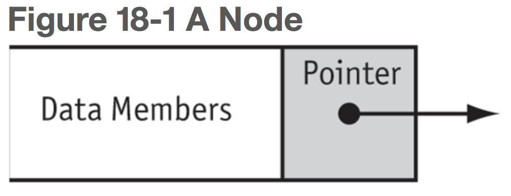
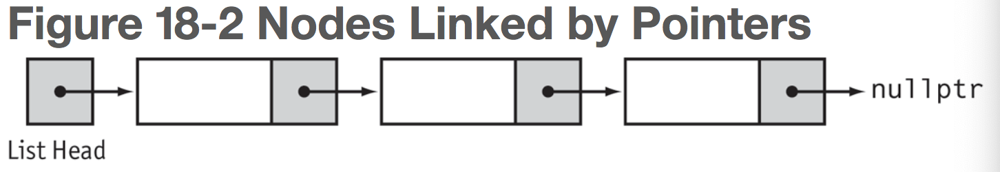

# Chapter 18: Linked Lists

### 18.1 Introduction to Linked Lists

Dynamically allocated data structures may be linked together in memory to form a chain.

**linked list** - a series of connected nodes, where each node is a data structure. The nodes of a linked list are usually dynamically allocated, used, then deleted, allowing the linked list to grow or shrink in size as the program runs.

- If new information needs to be added to a linked list, the program allocates another node and inserts it into the series.

- If a particular piece of information needs to be removed from the linked list, the program deletes the node containing that information.
- Each node in a linked list contains one or more members that hold data.
- In addition to data, each node contains a **successor pointer** that points to the next node in the list.

- The first node of a nonempty linked list is called the **head** of the list.
- To access the nodes in a linked list, you need to have a pointer to the head of the list.
- The successor pointer in the last node is set to `nullptr` to indicate the end of the list.
- 

- Nodes may be scattered around various parts of memory.

```c++
struct ListNode
{
   double value;	// data
   ListNode *next;	// successor pointer
  // (self-referential structure)
};

ListNode *head = nullptr;	// head
head = new ListNode;	// allocate new node
head->value = 12.5;		// store the value
head->next = nullptr;	// signify end of list

ListNode *secondPtr = new ListNode;
secondPtr−>value = 13.5;
secondPtr−>next = nullptr;   // second node is end of list
head−>next = secondPtr;      // first node points to second
```

- It is convenient to provide the structures that define the type for a list node with one or more constructors, to allow nodes to be initialized as soon as they are created.
- It is common to provide a default parameter of `nullptr` for the successor pointer of a node.

```c++
struct ListNode
{
   double value;
   ListNode *next;
   // Constructor
   ListNode(double value1, ListNode *next1 = nullptr)
   {
      value = value1;
      next = next1;
   }
};

ListNode *secondPtr = new ListNode(13.5);
ListNode *head = new ListNode(12.5, secondPtr);
// OR
ListNode *head = new ListNode(13.5);
head = new ListNode(12.5, head);
```

**Traversing a List**

```c++
ListNode *ptr = numberList;
while (ptr != nullptr)
{
   cout << ptr−>value << " ";   // Process node
   ptr = ptr−>next;             // Move to next node
}
```

### 18.2 Linked List Operations

The basic linked list operations are adding an element to a list, removing an element from the list, traversing the list, and destrouing the list.